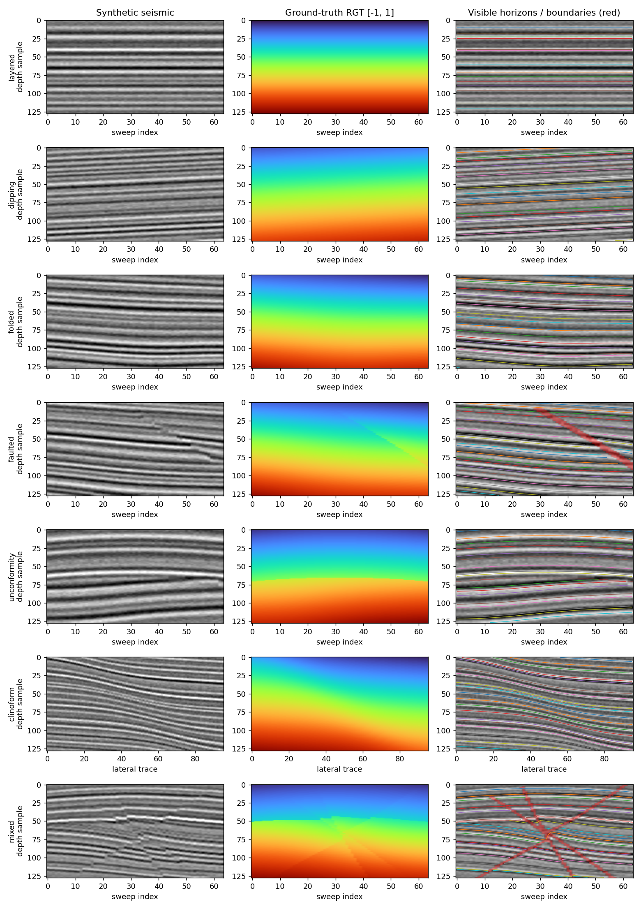
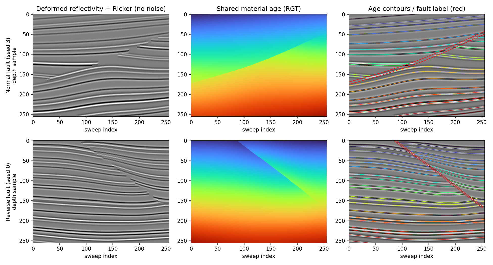

# Geological synthetic seismic suite

This suite generates paired 3D seismic amplitudes and relative geologic time
(RGT), structural masks, and TAPIR horizon tracks. It is inspired by Section 2.6
of Dou et al., *Learning Stratigraphically Consistent Relative Geologic Time
from 3D Seismic Data via Sinusoidal Mapping*,
[arXiv:2605.01273v3](https://arxiv.org/abs/2605.01273v3).
The paper describes 2,000 paired 512-cubed volumes and structural coverage,
but does not give a complete generator specification. This implementation is
an independent, smaller procedural suite, not a reproduction of their dataset
or RGT-Est neural network. Its structural transformations now implement
[Wu et al. (2020), *Building realistic structure models to train convolutional
neural networks for seismic structural interpretation*](https://doi.org/10.1190/geo2019-0375.1).

## Generate a saved dataset

Run from the repository root using the seismic environment with NumPy installed:

```powershell
python -m tapnet.seismic.generate_suite --output-dir datasets/geological-seismic --train-samples 140 --validation-samples 21 --test-samples 21 --seed 42
```

The destination must be new. It contains `manifest.json` and separate `train`,
`validation`, and `test` directories of compressed NPZ files. Each scene stays
in one split. The manifest records config, axis conventions, scenario IDs, and
each sample's seed, scenario, stride, and path. Separate seed namespaces keep
the splits independent of each other and of the online training stream.
Changing a split's size does not change existing samples in another split.

Defaults export full **256-by-256-by-256 cubes**, 20 horizon ages, 24 queries,
stride 1, and an 80-sample nominal peak throw budget. Dimensions, source/view
frame counts, noise, fault throw/count, scenarios, and frame strides have CLI
options. To export training-sized views from full cubes:

```powershell
python -m tapnet.seismic.generate_suite --output-dir datasets/geological-multistride256 --frames 64 --scene-frames 256 --train-samples 210 --validation-samples 21 --test-samples 21 --frame-strides 1 2 4 --seed 42
```

Generation cycles through all seven scenarios before advancing the stride,
covering the full scenario/stride product every 21 samples in this example.
The complete source cube is generated before selecting a view. All stride views
are centered on the same scene index, so narrower views retain
the central structures and shared indices refer to identical geology.
Whole-scene seeds differ between splits; slices of the same scene are never
randomly divided between training and evaluation.

## Train and evaluate TAPIR

The existing native PyTorch trainer consumes the suite online, without requiring
precomputed files or a new model architecture:

```powershell
python -m tapnet.seismic.train_torch --config geology-smoke --device cpu --output-dir checkpoints/geology-smoke --checkpoint-mode model-only
python -m tapnet.seismic.train_torch --config vdi-geology --device cuda --pretrained-checkpoint checkpoints/pretrained/bootstapir_checkpoint_v2.pt --output-dir checkpoints/geology-wu256-training
```

`geology-smoke` is one 2-frame, 64-by-64 update. `vdi-geology` generates a
256-by-256-by-256 source cube and uses **64-frame, 256-by-256 views**, 24 queries,
all scenarios, strides 1/2/4, and 5,000 updates. Stride 4 spans 253 source slices.
The throw budget is 80 samples, four times the previous setting. A single fault
can receive the full budget; multiple faults share it. Query chunks are reduced
to four for the larger images. Structural mapping and depth convolution run in
16-frame slabs to bound temporary CPU memory, with a halo at slab boundaries
and one RGT/amplitude normalization across the entire source cube.
It is a starting configuration; memory/throughput on the target GPU and useful
model quality have not been measured. The command initializes from the local
official BootsTAPIR checkpoint; the feature encoder is frozen by default.
`geology-smoke` has a smaller mixer and does not accept that official checkpoint.
Legacy configs continue to use the original generator.

To train exclusively with adjacent source slices, add `--frame-stride 1`:

```powershell
python -m tapnet.seismic.train_torch --config vdi-geology --frame-stride 1 --device cuda --pretrained-checkpoint checkpoints/pretrained/bootstapir_checkpoint_v2.pt --output-dir checkpoints/geology-wu256-stride1
```

This retains the full 256-cubed source volume and 64-frame view length; only the
stride mix changes. The override is stored in the checkpoint configuration.

The new geometry and source/view dimensions change the scene distribution and
labels. Re-export old
NPZ datasets to a new destination. An old geological training checkpoint can
initialize a new run with `--pretrained-checkpoint`; `--resume` deliberately
rejects its incompatible generator configuration. Existing exported files are
not modified.

The iterable dataset derives samples from `(seed, sample_index)` and partitions
indices between DataLoader workers. Training resume preserves both scene seeds
and the scenario/stride schedule. Dense volumes are computed for geology but
are omitted from the training batch because TAPIR uses point supervision.

Held-out inference supports both new configs:

```powershell
python -m tapnet.seismic.infer_torch --config geology-smoke --checkpoint checkpoints/geology-smoke/latest.pt --output-dir checkpoints/geology-eval --device cpu --num-examples 7
```

For a `vdi-geology` checkpoint, select `--config vdi-geology` and use at least
21 examples to cover every scenario/stride pair. Keep the evaluation seed
distinct from the training seed, as the existing inference CLI requires.
Saved NPZ volumes can separately serve dense RGT/fault training; this change
does not add an RGT model or a trainer that reads these files.

## Geological and label conventions

| Scenario | Geometry |
| --- | --- |
| `layered` | Horizontal, irregularly spaced beds |
| `dipping` | Strong inline and crossline dip |
| `folded` | Local Gaussian folds with changing layer thickness |
| `faulted` | Folded strata displaced along finite curved dipping faults |
| `unconformity` | Eroded folded package overlain by younger cover |
| `clinoform` | Laterally migrating sigmoid depositional fronts |
| `mixed` | Folding, faulting, clinoforms, and erosion together |

The generator begins with flat, irregularly spaced reflectivity impulses and
their material ages. Wu's linear shear and depth-scaled Gaussian deformation
produce folds. Each fault uses a strike/dip/normal coordinate system and an
interpolating biharmonic spline through nine random surface controls. Elliptic
slip peaks at the center and tapers to zero at the tips; quadratic attenuation
away from the surface creates fault drag. Both blocks move along the same
curved surface, preserving their signed surface distance. Positive slip creates
normal faults and negative slip creates reverse faults. Sequential faults can
displace earlier structures.

For each output voxel, inverse faults in reverse order and the analytic inverse
fold recover its material age. The same age evaluates the original reflectivity
profile and RGT. This avoids forward-splat holes and interpolation between
unrelated fault blocks. Ricker convolution happens **after** deformation,
followed by correlated noise, depth gain, and global amplitude scaling. Erosion,
clinoforms, and an erosional contact reflector are this suite's additions.
The implementation uses a decaying Gaussian and an orthonormal rotation basis,
correcting the printed signs in Wu's equations 3 and 5.

RGT is normalized once over the full scene to `[-1, 1]`, before slicing.
Horizon age values are shared across traces and fault blocks. A reverse fault
can repeat ages on one depth trace; an erosion hiatus or normal fault can omit
ages. Horizon extraction finds roots within continuous blocks, never across an
age jump. Multiple roots are marked ambiguous rather than treated as one track.
Physical distances use depth-sample units; each horizontal axis spans `H-1`
units regardless of its sampling resolution. `max_fault_throw` is a nominal
peak throw budget divided among faults, with slip capped to keep each block
mapping invertible; local throw varies with position and curvature.

| NPZ field | Shape / convention |
| --- | --- |
| `seismic`, `rgt` | float32 `[T, H, W]`, range `[-1, 1]` |
| `reflectivity` | float32 `[T, H, W]`, structurally deformed before convolution |
| `fault_mask`, `unconformity_mask` | bool `[T, H, W]` |
| `fault_discontinuity_mask` | bool `[T, H, W]`, high sample of a depth crossing |
| `horizon_depths`, `horizon_visible` | `[K, T, W]`, float32 depths / bool |
| `horizon_valid`, `horizon_root_count` | `[K, T, W]`, bool / int32 |
| `horizon_rgt` | float32 `[K]`, ordered age values |
| `horizon_reflectivity`, `age_bounds` | float32 `[K]` coefficients / `[2]` raw age range |
| `wavelet`, `depth_gain`, `amplitude_scale` | float32 `[L]`, `[H]`, scalar |
| `fault_parameters` | float32 `[max_faults, 10]`, column names in manifest |
| `fault_surface_controls` | float32 `[max_faults, 9, 3]`, normalized strike/dip and normal offset |
| `video` | float32 `[T, H, W, 3]`, repeated scalar seismic |
| `query_points` | float32 `[N, 3]`, `[frame, depth, lateral]` |
| `target_points` | float32 `[N, T, 2]`, `[lateral, depth]` |
| `occluded`, `label_valid` | bool `[N, T]` |
| `trackgroup` | int32 `[N]`, index into the horizon arrays |
| `frame_indices` | int32 `[T]`, indices in the oriented scene |
| `scenario_id`, `fault_count`, `frame_stride`, `scene_num_frames` | int32 scalars |
| `faulted`, `sweep_reversed` | bool scalars |

`fault_mask` labels the finite curved fault sheet. `fault_label_width` adds
physical thickness to this segmentation mask; it never erases reflectivity or
changes tracking labels. `unconformity_mask` marks depth intervals crossing the
erosional contact. Parameter/control rows beyond `fault_count` are zero padding.
An absent horizon sets `occluded=True`, `label_valid=True`. A repeated horizon
sets `horizon_visible=True`, `horizon_valid=False`, and `label_valid=False`, so
all position and visibility losses ignore the ambiguous frame. Its stored depth
is only the first intersection. Positions for absent or ambiguous horizons are
bounded placeholders interpreted through these masks. Queries always start at
a visible, unambiguous target. Targets keep lateral trace fixed and follow one age.
Reversal and frame striding apply identically to seismic, RGT, masks, and labels.

## Python API and preview

```python
import numpy as np
from tapnet.seismic.geology import GeologicalSeismicConfig
from tapnet.seismic.geology import generate_geological_sample
from tapnet.seismic.geology import generate_geological_volume

config = GeologicalSeismicConfig()
volume = generate_geological_volume(config, 42, scenario='mixed')
sample = generate_geological_sample(config, 42, include_volume=True)
with np.load('datasets/geological-seismic/train/000000.npz', allow_pickle=False) as saved:
    amplitudes, rgt = saved['seismic'], saved['rgt']
```

```powershell
python -m scripts.preview_geological_seismic --output docs/geological_seismic_preview.png
python -m scripts.preview_geological_seismic --fault-examples --output docs/wu_fault_examples_256.png
python -m pytest tests/test_seismic_structure.py tests/test_seismic_geology.py tests/test_seismic_torch_data.py tests/test_seismic_torch_config.py
```





## Limits and verification

Faults implement curved dip slip, finite extent, drag, and reverse-fault age
repetition. This is a kinematic model; it does not simulate mechanical stress,
growth faults, or reliably preserve single-branch labels through overturned
strata. Folds and clinoforms are analytic approximations. The renderer does not
simulate impedance/velocity physics, wave propagation, illumination, multiples,
diffractions, migration, salt, or survey acquisition. Horizons can be thin enough
for wavelet interference, so an age surface is not necessarily a seismic peak.
There is no field-data calibration or demonstrated synthetic-to-field accuracy.

Automated tests check invertible displacement on both fault blocks, curved
surface continuity, finite tips, sequential restoration, shared reflectivity/RGT
coordinates, convolution order, segmentation/amplitude independence, reverse
fault ambiguity, age-surface interpolation, erosion hiatuses,
track/volume alignment after reversal and striding, deterministic generation,
all scenario/stride combinations, worker partitioning, stream resume, NPZ
round-trips, and split isolation. A CPU smoke update verifies the data/model/loss
path and checkpoint writing; it is not evidence of model quality.

Earlier 128-by-128 validation on 2026-10-09: the repository test suite passed
with **144 tests**. Seven CPU updates completed with `vdi-geology --num-frames 2`, initialized from
the official BootsTAPIR checkpoint, with finite losses/gradients across all
seven scenarios and a saved model-only checkpoint. This checks model compatibility,
not training convergence or full-size GPU memory. Clean normal/reverse examples
and the seven-scenario preview were rendered and visually inspected. A new
21-scene starter export is at `datasets/geological-seismic-wu-demo` (seven scenes
per split); the old starter export retains the previous generator's data.
Held-out inference completed on all seven scenarios using the saved checkpoint.
A full 32-frame, 128-by-128 mixed stride view generated from a 125-frame source
scene, and 210 additional small scenes spanning 30 seeds, all scenarios, and
strides 1/2/4 generated finite data with valid query starts, including large throws.

256-cubed validation: all **150 tests** passed after the size/view changes,
including comparison of slabbed deformation against whole-volume restoration.
Normal and reverse examples were generated from complete 256-cubed volumes
and visually inspected. A 64-frame, 256-by-256 mixed stride-4 view generated
successfully from all 256 source slices, with finite data and valid query starts;
its source indices were 0 through 252. That sample took about 38 seconds on
the local CPU while another generation job was running, so CPU generation
throughput deserves profiling on the training host. A pretrained CPU update at
256-by-256 resolution also completed with finite loss/gradients, using two view
frames while retaining the 256-frame source. Full 64-frame GPU training memory
has not been measured. Examples are saved in
`datasets/geological-wu-256-view-example` and `datasets/geological-wu-256-cube-example`.
